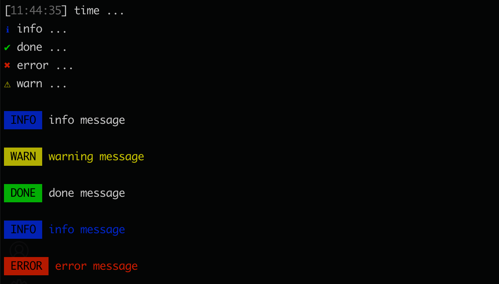

# diy-log

Log things, prefixed with a symbols or timestamp.




## Installation

```bash
npm install diy-log --save-dev
```


## Usage

```js
// for cjs
const dLog = require('diy-log')
const { log, symbols, colors, timestamp } = dLog


// for esm
import dLog, {
  log,
  colors,
  symbols,
  timestamp
} from 'diy-log'
```

```js
dLog.log('log ...')
dLog.time('time ...')

dLog.info('info ...')
dLog.success('success ...')
dLog.error('error ...')
dLog.warn('warn ...')

log(symbols.info, 'info ...')
log(symbols.success, 'success ...')
log(symbols.error, 'error ...')
log(symbols.warn, 'warn ...')

// see `picocolors`
log(
  colors.blue('color: blue;'),
  colors.bgGreen('bgcolor: green;'),
  colors.bold('font-weight: bold;'),
  colors.italic('font-style: italic')
)

// see `time-stamp`
log(
  colors.bgRed(timestamp('YYYY/MM/DD HH:mm:ss'))
)
```


## Thanks

- [log-symbols](https://github.com/sindresorhus/log-symbols)
